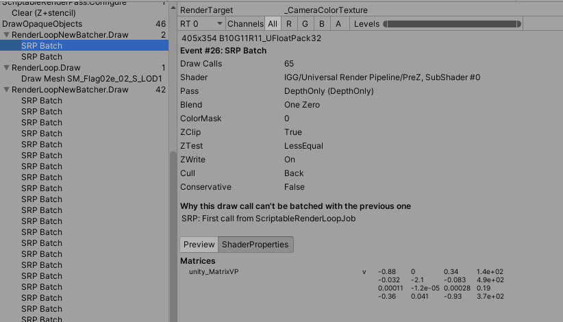

# 介绍
场景上不能严格排序 一旦EarlyZ被打断 Shading的消耗非常高,  PASS1:先渲染场景深度图，PASS2:hading阶段深度相等才绘制，Shading阶段不需要Alpha Test，配合ealy-z可以在片元阶段之前做剔除。除了场景材质排序打破Early-Z 还有一种情况early-Z无法做到像素级的优化，这种情况也非常常见场景里大量的mesh插到地表以下。

# 对比
在我们项目里加上preZ后， GPU cycle数从8540025降到6717825,原来500s内发热掉帧到2个小时不掉帧。
# Pros
在shading消耗高的情况下，可以考虑使用PreZ
# Cons
在场景mesh带宽高的情况下，需要对比带宽增加和shading优化带来的收益对比

# 注意
直接在物件上写depthOnly pass会被材质上变体不一致打断SRP Batcher合批，实际实现的时候PreZ Pass不需要关心其他变体，只需要关心透贴变体，所以可以按材质类别进行分组，opaque shader统一使用单独的shader pass合批渲染，带透贴的材质单独即可

