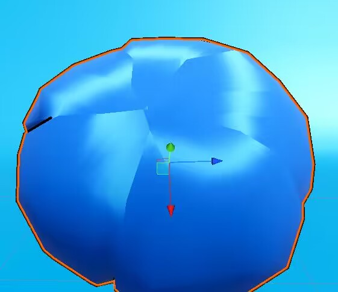
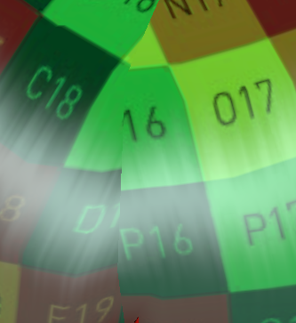
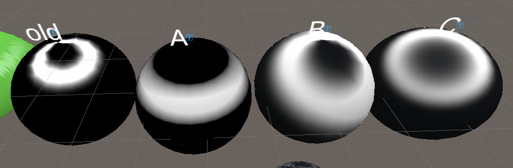
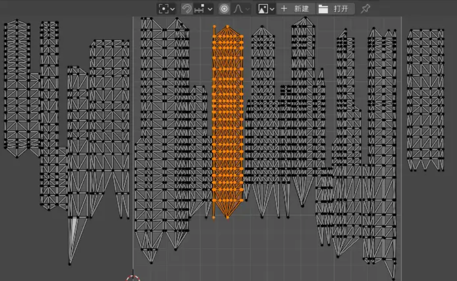
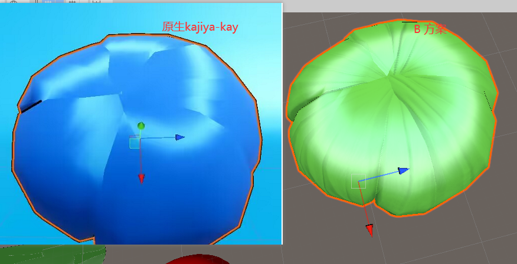
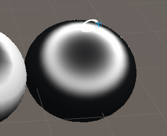
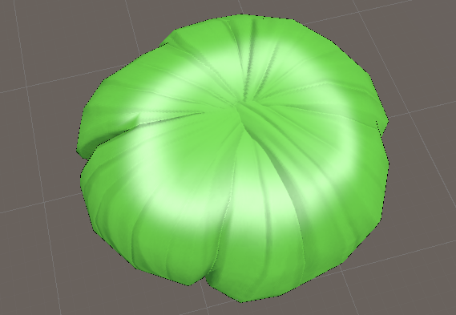

# 卡通头发渲染
# 简介
原生的Kajiya-kay model+TangentMap渲染方案不适合块状的头发渲染，高光流向是顺着切线方向，对模型的切线方向有要求。默认模型不处理切线的话会产生一下高光断裂的情况。KK+tangentMap的方案更适合类似yeager插片头发的方案。

先分析一下高光断裂的形成原因 kk方案高光形成无法形成一个完美的天使环高光，原因在于切线方向走向，

未经法线偏移的切线是顺着uv方向，kk各项异性高光的计算是基于 T（切线）,H（半角向量）计算的高光， T信号的不连续而导致以上各项异性天使环高光断裂的问题。
经过研究对此改进方案有三种：A,B,C下面会一一介绍，shader上，

选择各项异性高光类型。

以下是A,B，C方案高光环对比：

A: 使用坐标系模拟高光 
    基本原理：直接用坐标系计算，物件空间y轴计算高光位置。视角朝向计算高光偏移
    优点：不依赖uv
    缺点：高光不通过物理计算，只适合卡通渲染

	
B: 基于FlowMap T(基于法向偏移)·H （推荐使用）
	基本原理：既然原模型T(切线)不连续，那就画一个!   用Flowmap映射头型实现完美的天使环高光   
	优点：效果好，更趋近物理
	缺点：需要Flowmap来优化各向异性高光
	对uv有要求，uv最好像这样竖直拉直，

	
	目前测试模型不是拉直的 所有需要稍微调整TangentDir。jitter扰动也是顺着v方向（拉直避免扰动方向歪了）
	 
	
	基于B方案临时调的效果对比：
	

C: N·H(基于光向偏移)
	基本原理：
		不通过T(切线计算高光) ,通过N(法线) H(半角向量模拟) 只要法线是平滑的，基本可以趋近一个完美光环
	
		
	优点：可以少一张FlowMap贴图
	缺点：需要光滑，或调整法线朝向来优化各项异性高光

总结：
		 C方案可以不用FlowMap　但需要调整法线朝向效果不及B方案，
	         B方案需要FlowMap，该方案兼容PBR和卡通的渲染效果(推荐使用)
		 A方案只适合卡通渲染
