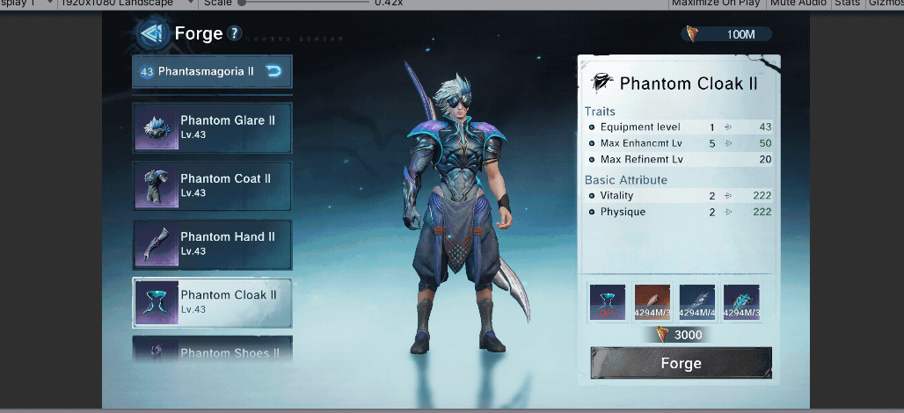
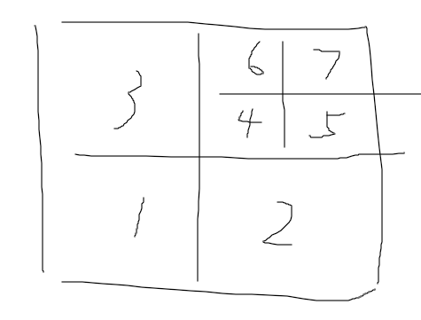
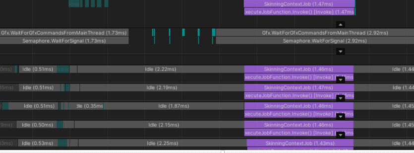
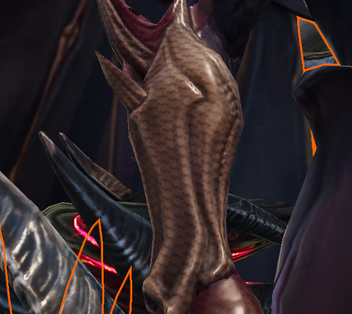

# 角色优化
    演示：

# 简介
    实现了一个批次及骨骼优化后的角色，角色支持动态换装，动态骨骼。Job化生成过程三星s8上2ms以内， 可用于手机上实时生成
# 功能点
1. GPU合并压缩贴图 

1. 最少化骨骼Bake
2. Mesh合并合批
3. 基于Job蒙皮
  
4. 处理Culling
5. 处理LOD
6. 装备配置数据序列化，反序列化
7. 处理Artifacts等。

