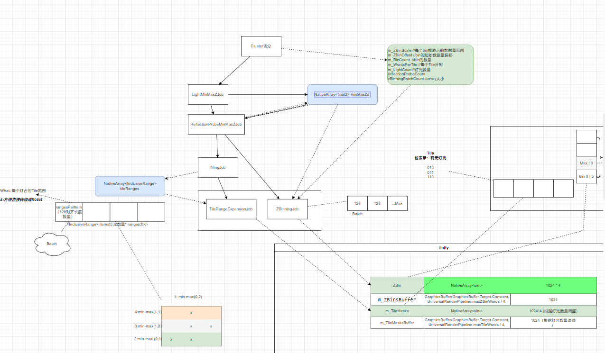
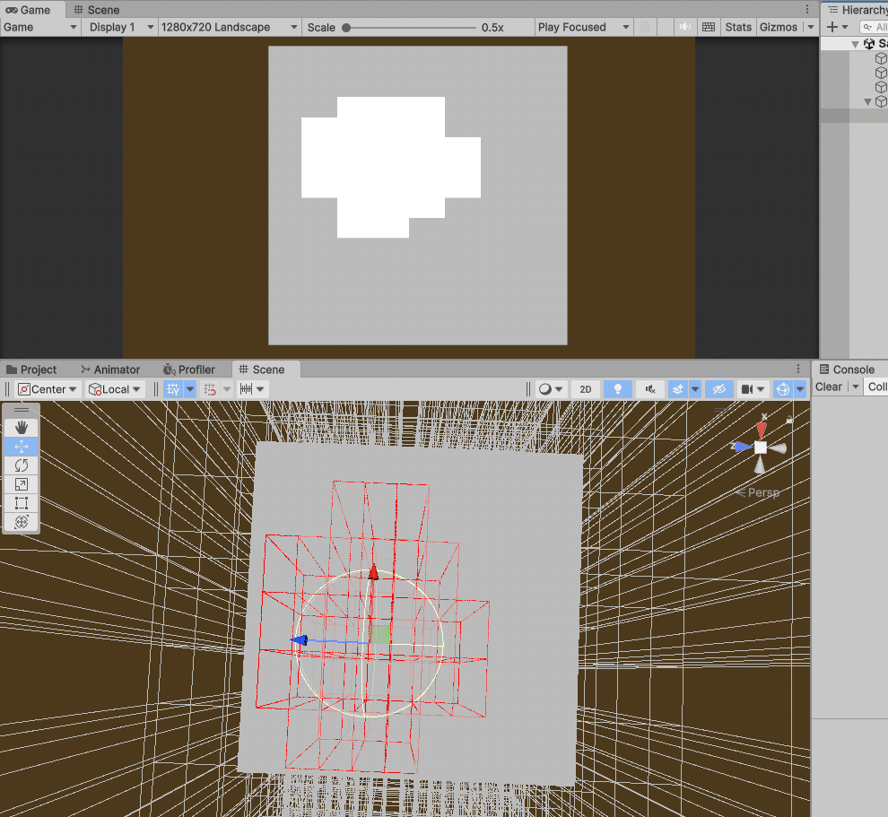
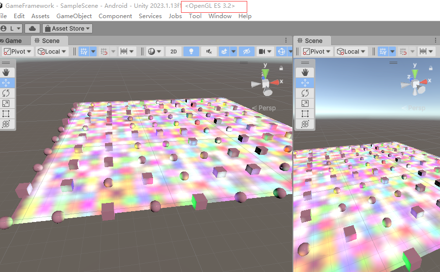
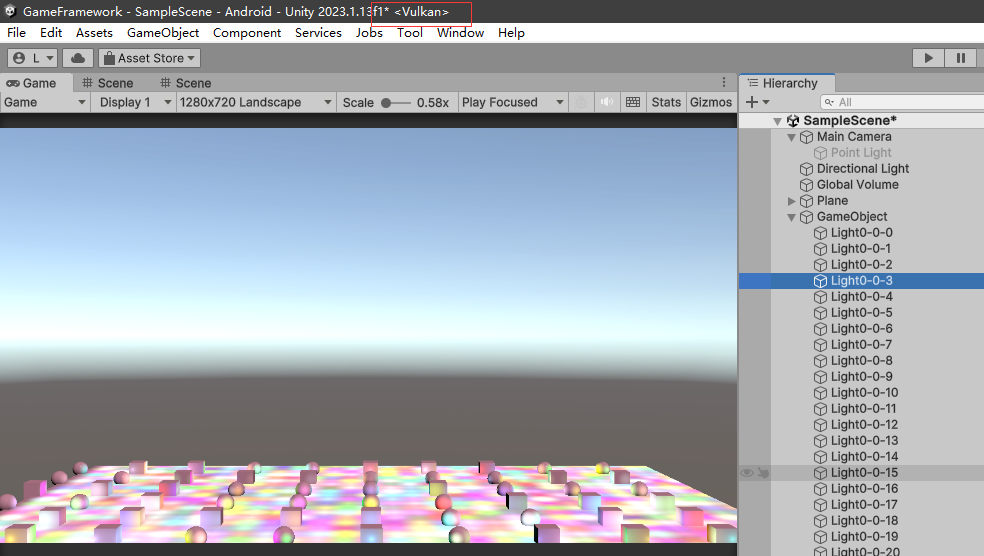

# ClusterLighting
## 成果（小米9录屏）
<video src="1-1.mp4" controls title="Title"></video>
## 流程图

## 特性
- Debug系统
  
- 集成到自定义管线&Shader
- 兼容OpenGL&Vulkan等各大API
  
- 
- 兼容低端机 (tiling + z-binning job方式剔除光源。shader model 4.5+ 采用compute shader剔除光源 )
- 方便扩展：可剔除云雾烟 lightprobe等计算量