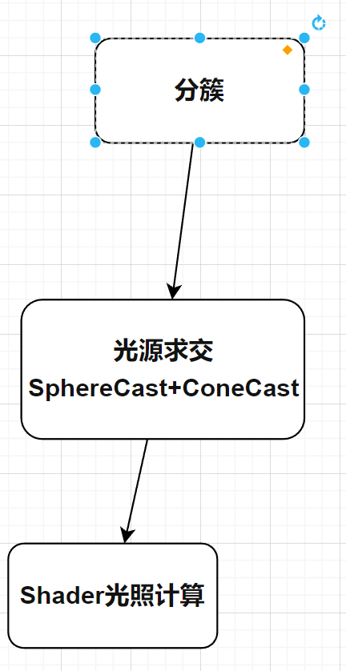

# ClusterLighting
## 成果（小米9录屏）1024盏光源PBR渲染
<video src="Screenrecorder-2023-10-27-17-29-10-786.mp4" controls title="Title"></video>

## 流程图
computeShader流程

binningJob流程（高度优化的多线程Job）

## 特性
- 上千光源的支持。（Unity： URP perCamera 32个,PerObject 8个）
- Debug系统
  

- 集成到自定义管线&Shader
- 兼容OpenGL&Vulkan等各大API
 
 
  
- 兼容低端机 (tiling + z-binning job方式剔除光源。shader model 4.5+ 采用compute shader剔除光源 )
- 方便扩展：可剔除云雾烟 lightprobe等计算量