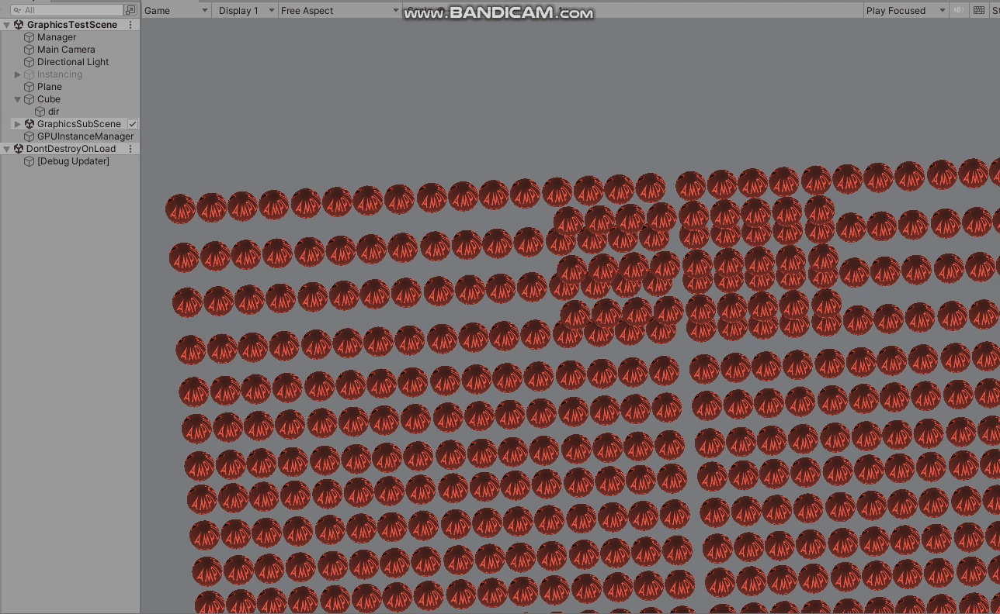

# GPUInstance管理
## 简介 
  使用DrawMeshInstanced + MaterialPropertyBlock兼顾兼容性和性能的GPUInstance方案，硬件支持的话可以使用DrawMeshInstancedIndirect + ComputeBuffer
演示：

## 特性
- 距离+触发器管理加卸载
- gpu instancing
- support LOD
- v1: CullingGroup + FrustumJob执行剔除
- v2: ECS culling