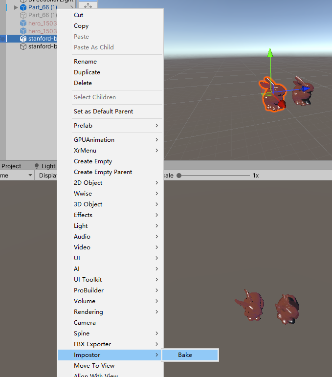
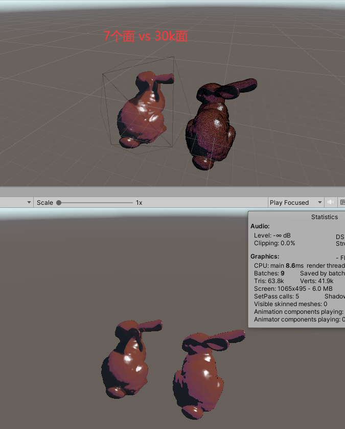

# 全烘焙Impostor

# 介绍：
在物件空间半八面体视角给物件拍照，渲染信息烘焙在图片上并使用面片billbord渲染。对比市面上烘焙材质信息,在shader里做shading的方案贴图量省1/4 shader开销大大降低。该方案可以大大降低几何带宽和渲染开销。
使用场景：结构复杂高面数的小物件

# 使用方法：
1.右键物件选择 Impostor/Bake

# 效果对比

# 注意点：
场景里少量使用的物件烘焙可能不划算。
如果是房间那种固定视角的物件可以配置成只拍一张（更清晰）
