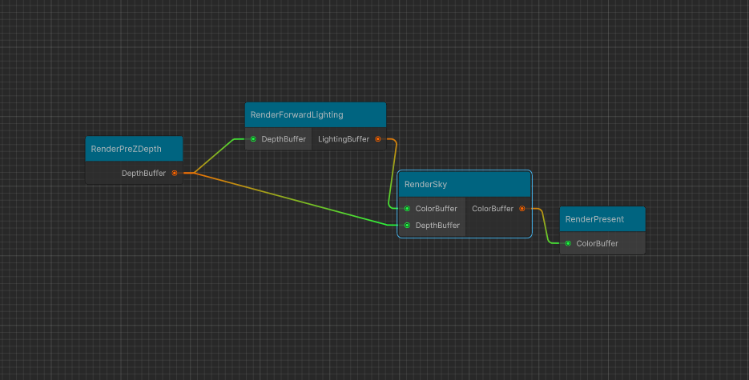

# LeapRenderPipeline

我的完全自定义的渲染管线。

# 目前已支持的特性
- [[RenderGraph/README]](/_Optimization/LeapRenderPipeline/RenderGraph/)
- [[PreZ/README]](/_Optimization/PreZ)
- [[ClusterLighting/README]](/_Optimization/ClusterLighting/)