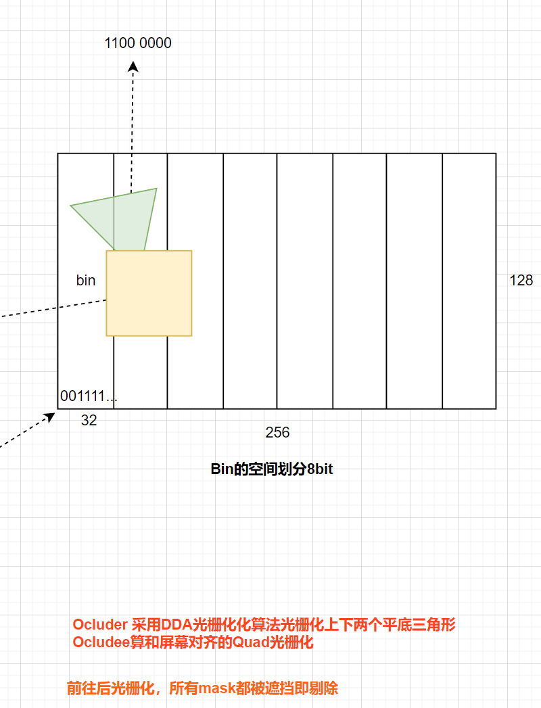
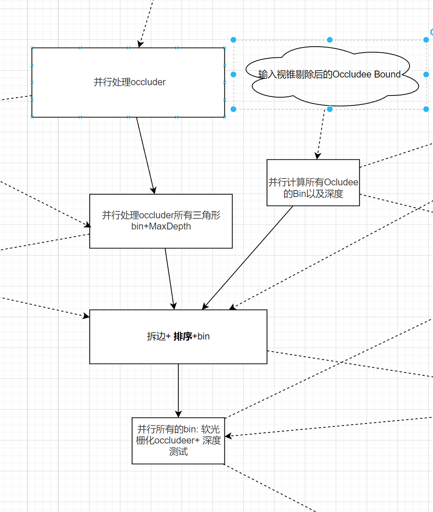
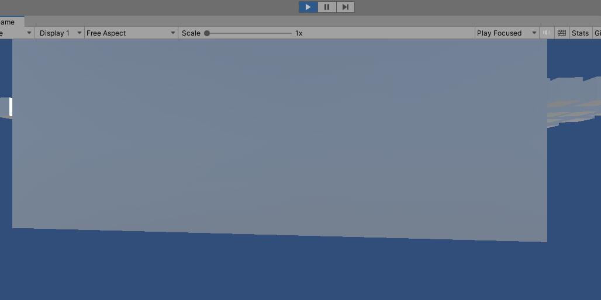

# 遮挡剔除

以下支持率低到高。各有优缺点需要结合项目使用

### PVS（done）
    pros：消耗低（仅有极低的CPU消耗），可以兼容低端机
    cons：需要预处理体素化场景，烘焙格子的可见性信息

### SOC （done）
[[SOC/README]](/_Optimization/OC/SOC/)

数据结构

流程

    pros：软光栅的方法生成遮挡信息，可以兼容低端机
    cons：需要预处理指定occluder，occludee。不稳定的CPU消耗

### 改进的HiZ（working）
    HiZ最大的问题是GPU回传latancy造成的当前帧剔除错误，比如一个当前没被遮挡的物体因为几帧前被遮挡而被错误剔除掉了导致没显示出来. 改进的HiZ解决了这个问题:

    pros：完全脱离人工配置的烦恼，每个物件都可以是遮挡物和被遮挡物
    cons：需要具有间接渲染功能的GPU
### 利用硬件的OC （done）
    ShaderModel5以后可以很方便的利用[earlydepthstencil]做剔除,但CPU回读也是有延迟的；

## 总结
HiZ则需要ComputeShader的支持需要ShaderModel4.5+,移动设备支持率较差 需要OpenGLES3.1以上，而且有些机型存在兼容性问题。手机上较为通用OC方案是PVS和SOC